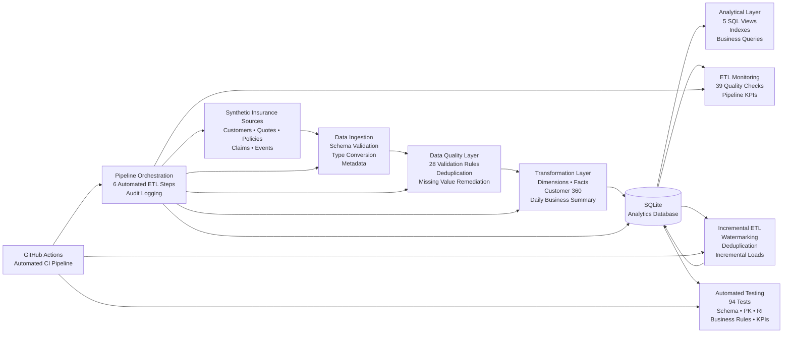

# Insurance Data Engineering Platform

End-to-end data engineering platform simulating an insurance company's analytical data infrastructure.

The project covers source data generation, ingestion, data quality validation, ETL transformation, analytical data modeling, database loading, pipeline monitoring, orchestration, incremental loading, automated testing and CI/CD.

---

## [TR] Proje Hakkında

Insurance Data Engineering Platform, sigorta sektöründeki gerçek dünya veri mühendisliği süreçlerini uçtan uca simüle etmek amacıyla geliştirilmiştir.

Proje yalnızca veri analizi yapmak yerine; farklı operasyonel veri kaynaklarından gelen verilerin alınması, kalite kontrollerinden geçirilmesi, dönüştürülmesi, analitik veri modeline aktarılması, izlenmesi ve artımlı olarak güncellenmesi süreçlerine odaklanmaktadır.

Pipeline içerisinde müşteri, teklif, poliçe, hasar ve dijital kullanıcı etkileşim verileri işlenmektedir.

### Temel Özellikler

- Synthetic insurance data generation
- Multi-source data ingestion
- Schema ve data type validation
- Automated data quality rules
- Missing value remediation
- Duplicate detection & removal
- Referential integrity validation
- Fact & dimension data modeling
- Customer 360 dataset
- Daily business summary
- SQLite analytical database
- Database indexing
- Analytical SQL views
- ETL pipeline monitoring
- Business KPI monitoring
- Pipeline orchestration
- Execution audit logging
- Incremental ETL
- Watermark-based loading
- Duplicate prevention
- Automated pipeline testing
- GitHub Actions CI pipeline

---

## Architecture



Detaylı mimari dokümantasyonu:

`docs/architecture.md`

---

## Data Sources

Platform beş temel sigorta veri kaynağını simüle etmektedir.

| Dataset | Initial Records | Description |
|---|---:|---|
| Customers | 10,000 | Customer demographic and registration data |
| Quotes | 50,025 | Insurance quote transactions |
| Policies | 10,613 | Converted insurance policies |
| Claims | 4,000 | Insurance claim transactions |
| Events | 100,000 | Digital customer interaction events |

Synthetic source generation aşamasında kontrollü data quality problemleri de oluşturulmaktadır.

Bunlar:

- 50 missing customer city values
- 100 missing quote premium values
- 25 duplicate quote records

Bu problemler pipeline'ın data quality katmanında otomatik olarak tespit edilmekte ve giderilmektedir.

---

## ETL Pipeline

### 01 — Source Data Generation

`01_generate_insurance_data.py`

Synthetic insurance source datasets oluşturur.

Üretilen temel domainler:

- Customers
- Quotes
- Policies
- Claims
- Digital Events

---

### 02 — Data Ingestion

`02_data_ingestion.py`

Raw source dosyalarının ingestion sürecini gerçekleştirir.

İçerir:

- Source file validation
- Schema validation
- Data type conversion
- Initial data quality profiling
- Primary key checks
- Referential integrity checks
- Ingestion metadata generation

---

### 03 — Data Quality Validation

`03_data_quality_validation.py`

Toplam **28 data quality rule** çalıştırır.

Kontroller arasında:

- Null validation
- Primary key uniqueness
- Valid categorical values
- Positive monetary values
- Referential integrity
- Business constraints

bulunmaktadır.

Controlled source issues başarıyla tespit edilip giderilmektedir:

```text
Missing customer cities     -> repaired
Duplicate quote IDs         -> removed
Missing quote premiums      -> repaired
```

---

### 04 — Data Transformation

`04_data_transformation.py`

Clean source datasets analitik veri modeline dönüştürülmektedir.

Oluşturulan tablolar:

```text
dim_customer
fact_quotes
fact_policies
fact_claims
fact_events
customer_360
daily_business_summary
```

Customer 360 tablosu müşteri seviyesinde teklif, poliçe, claim ve dijital davranış verilerini bir araya getirir.

---

## Analytical Database

### 05 — Database Loading

`05_database_loading.py`

Transformed datasets SQLite analytical database'e yüklenmektedir.

Database:

```text
insurance_analytics.db
```

Oluşturulan yapı:

```text
7 analytical tables
5 analytical SQL views
12 database indexes
```

### Analytical Views

```text
vw_quote_conversion_by_channel
vw_product_performance
vw_policy_portfolio
vw_claim_performance
vw_customer_value
```

Bu view'lar channel conversion, product performance, policy portfolio, claims ve customer value analizlerini desteklemektedir.

---

## Pipeline Monitoring

### 06 — ETL Pipeline Monitoring

`06_etl_pipeline_monitoring.py`

Pipeline'ın teknik ve business health kontrollerini gerçekleştirir.

Son başarılı çalıştırmada:

```text
Total checks:  39
Passed checks: 39
Failed checks: 0

Pipeline status: HEALTHY
```

İzlenen temel KPI'lar:

```text
Customers:          10,000
Quotes:             50,000
Converted Quotes:   10,613
Conversion Rate:    21.23%
Policies:           10,613
Claims:             4,000
Events:             100,000
Written Premium:    35,381,085.49
Claim Amount:       21,941,974.13
Loss Ratio Proxy:   62.02%
```

---

## Pipeline Orchestration

### 07 — Pipeline Orchestration

`07_pipeline_orchestration.py`

Ana ETL pipeline'ını tek workflow altında çalıştırmaktadır.

```text
1. Source Data Generation
2. Data Ingestion
3. Data Quality Validation
4. Data Transformation
5. Database Loading
6. ETL Pipeline Monitoring
```

Her pipeline execution için unique run ID oluşturulur.

Örnek:

```text
RUN_20261004_023510_af395cf3
```

Her step için:

- Start time
- End time
- Duration
- Execution status
- Run ID

audit log içerisinde tutulmaktadır.

Başarılı pipeline çalıştırması:

```text
Total Steps:       6
Successful Steps:  6
Failed Steps:      0
Pipeline Status:   SUCCESS
```

---

## Incremental ETL

### 08 — Incremental Data Loading

`08_incremental_etl.py`

Platform yalnızca full refresh değil, incremental data processing de desteklemektedir.

Incremental ETL içerisinde:

- Watermark management
- Event sequence management
- Old-record filtering
- Duplicate prevention
- Referential integrity validation
- Incremental transformation
- Append loading
- Post-load validation
- Incremental audit logging

uygulanmaktadır.

Örnek başarılı batch:

```text
Source rows:                  5,050
Eligible new rows:            5,000
Rejected old/duplicate rows:     50
Inserted rows:                5,000
Load status:                SUCCESS
```

Sonuç:

```text
fact_events

100,000
   ↓
105,000
```

Watermark yalnızca başarılı load sonrasında güncellenmektedir.

---

## Automated Data Pipeline Testing

### 09 — Automated Pipeline Tests

`09_pipeline_tests.py`

Data pipeline için otomatik test katmanı bulunmaktadır.

Test kategorileri:

- Database object tests
- Schema tests
- Row count tests
- Primary key tests
- Referential integrity tests
- Business rule tests
- Incremental ETL tests
- Analytical view tests
- KPI consistency tests

Son test sonucu:

```text
Total tests:   94
Passed tests:  94
Failed tests:   0
Pass rate:    100%

Overall status: ALL TESTS PASSED
```

Herhangi bir test başarısız olduğunda script non-zero exit code döndürür. Böylece CI pipeline başarısız testleri otomatik olarak tespit edebilir.

---

## CI/CD — GitHub Actions

Repository içerisinde GitHub Actions workflow bulunmaktadır:

```text
.github/workflows/data-pipeline.yml
```

Workflow aşağıdaki durumlarda çalışabilir:

```text
Push to main
Pull request to main
Manual workflow dispatch
```

CI workflow:

```text
Checkout Repository
        ↓
Set Up Python
        ↓
Install Dependencies
        ↓
Run Full ETL Pipeline
        ↓
Run Incremental ETL
        ↓
Run Automated Tests
        ↓
Upload Test & Monitoring Artifacts
```

Bu yapı sayesinde repository içerisindeki pipeline değişiklikleri otomatik olarak doğrulanabilir.

---

## Project Structure

```text
Insurance_Data_Engineering_Platform/
│
├── .github/
│   └── workflows/
│       └── data-pipeline.yml
│
├── docs/
│   └── architecture.md
│
├── src/
│   ├── 01_generate_insurance_data.py
│   ├── 02_data_ingestion.py
│   ├── 03_data_quality_validation.py
│   ├── 04_data_transformation.py
│   ├── 05_database_loading.py
│   ├── 06_etl_pipeline_monitoring.py
│   ├── 07_pipeline_orchestration.py
│   ├── 08_incremental_etl.py
│   └── 09_pipeline_tests.py
│
├── .gitignore
├── requirements.txt
└── README.md
```

Generated datasets, databases and runtime outputs are excluded from version control and regenerated by the pipeline when required.

---

## Technologies

- Python
- Pandas
- NumPy
- SQL
- SQLite
- ETL / ELT Concepts
- Data Quality Engineering
- Data Modeling
- Incremental Loading
- Watermarking
- Pipeline Monitoring
- Automated Data Testing
- GitHub Actions
- CI/CD

---

## How to Run

Install dependencies:

```bash
pip install -r requirements.txt
```

Run the complete ETL pipeline:

```bash
python src/07_pipeline_orchestration.py
```

Run incremental ETL:

```bash
python src/08_incremental_etl.py
```

Run automated tests:

```bash
python src/09_pipeline_tests.py
```

---

# [ENG] Project Overview

Insurance Data Engineering Platform is an end-to-end data engineering project designed to simulate a production-style analytical data infrastructure for an insurance business.

Rather than focusing only on analysis or machine learning, the project demonstrates the complete data lifecycle from operational source generation to validated analytical datasets.

The platform processes customer, quote, policy, claim and digital interaction data through a reproducible ETL architecture.

The solution includes:

- Synthetic multi-domain source generation
- Automated ingestion
- Schema validation
- Data quality engineering
- Data remediation
- Fact and dimension modeling
- Customer 360 modeling
- Analytical SQL database
- Database indexes and SQL views
- ETL monitoring
- Business KPI monitoring
- Pipeline orchestration
- Execution auditing
- Incremental ETL
- Watermark-based loading
- Deduplication
- Automated pipeline testing
- GitHub Actions CI

### Pipeline Results

```text
Data Quality Rules       28
Monitoring Checks        39
Automated Tests          94
Automated Test Pass Rate 100%
```

The full ETL pipeline successfully executes all six core processing stages, while the incremental loading layer processes only eligible new records and prevents old or duplicate records from entering the target analytical dataset.

The repository is designed so generated datasets and database artifacts do not need to be stored in version control. The complete analytical environment can be rebuilt through the pipeline.

---

## Purpose

This project demonstrates practical knowledge of:

**Data Engineering**

Designing reproducible ingestion, transformation and loading workflows.

**Data Quality**

Implementing automated validation and remediation rules.

**Data Modeling**

Building fact tables, dimensions and customer-level analytical datasets.

**Database Engineering**

Creating analytical tables, indexes and reusable SQL views.

**Pipeline Reliability**

Monitoring data quality, referential integrity and business KPIs.

**Incremental Processing**

Using watermarks, deduplication and post-load validation.

**Automated Testing**

Validating schemas, primary keys, relationships, business rules and analytical consistency.

**CI/CD**

Automatically executing and validating the data pipeline using GitHub Actions.

---

## Author

**Büşra Sarı**

Statistics Graduate — Hacettepe University

Data Analytics • Data Science • Data Engineering