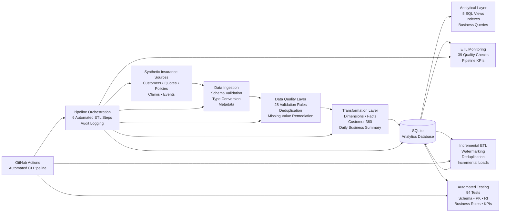

# Insurance Data Engineering Platform — Architecture

## Pipeline Flow

1. Synthetic insurance source data is generated.
2. Source files are ingested and schema-validated.
3. Data quality rules detect controlled source-data issues.
4. Invalid or duplicate records are remediated.
5. Clean datasets are transformed into analytical fact and dimension tables.
6. Transformed data is loaded into SQLite with indexes and analytical views.
7. Pipeline health and business KPIs are automatically monitored.
8. The complete ETL workflow is orchestrated with execution audit logs.
9. Incremental event data is processed using watermark-based loading and deduplication.
10. Automated pipeline tests validate schemas, keys, referential integrity, business rules and KPI consistency.
11. GitHub Actions executes the pipeline and tests automatically on repository changes.